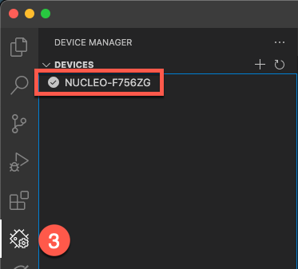
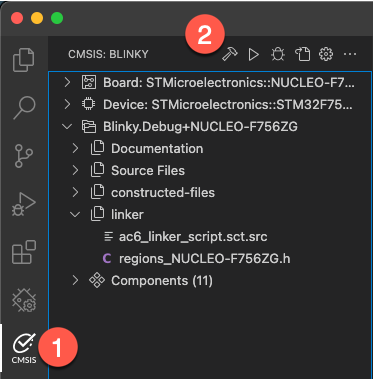

# Blinky project

The **Blinky** project is a simple example that is used to verify the basic tool and hardware setup.

It is compliant to the Cortex Microcontroller Software Interface Standard (CMSIS) and uses the CMSIS-RTOS2 API
interface for RTOS functionality. The CMSIS-RTOS2 API is available with various real-time operating systems, for
example RTX5 or FreeRTOS.

## Step 1: Connect the Hardware

1. Connect the development board to your computer using a Micro-USB cable.
2. If the ST-Link is not recognized automatically, you might be missing the correct drivers. Please download the
   drivers from [st.com](https://www.st.com/en/development-tools/stsw-link009.html#st-get-software) and install them
   on your machine.
3. Check if the board has been recognized correctly by opening the **Device Manager View**. It should show the board
   being connected to your computer:  
   

## Step 2: Build the Project

Launch VS Code and open this folder.

1. Go to the **CMSIS View**.
2. Build the project:  
     
   The project should build without warnings.

## Step 3: Start the Debug Session

1. Switch to **Run and Debug** and select **STLink@pyOCD (launch)**.
2. Click the **Play** icon to launch the debug session.  
   

### Operation

- At start the vioLED0 blinks in 1 sec interval.
- The vioBUTTON0 changes the blink frequency and start/stops vioLED1.

  

### CMSIS-Driver Virtual I/O mapping

| CMSIS-Driver VIO      | Board component
|:----------------------|:--------------------------------------
| vioBUTTON0            | USER button (B1)
| vioLED0               | LED red     (LD3)
| vioLED1               | LED green   (LD1)
| vioLED2               | LED blue    (LD2)

## Conclusion

By now, you should have a tools and hardware setup that works with Keil Studio.

## Where to go next

The next lab talks about how to convert µVision uvprojx files to CMSIS solution projects. Please check the
[README](../uv2csolution/README.md)
