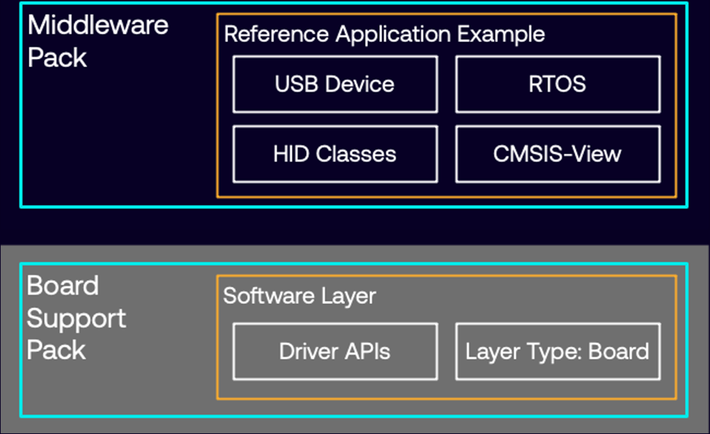
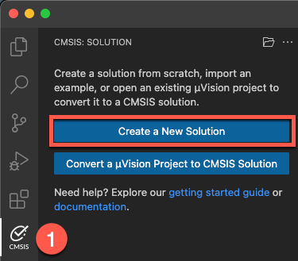
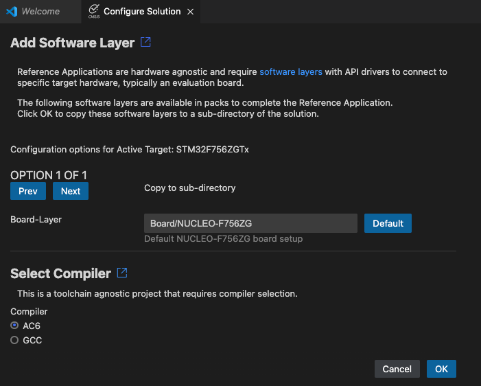
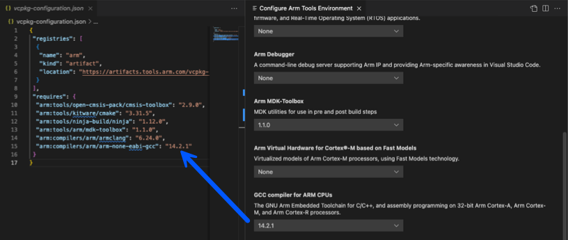
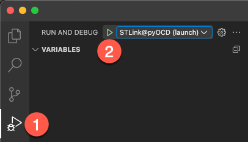

# Reference Applications

CMSIS v6 introduces the concept of
[software layers](https://open-cmsis-pack.github.io/cmsis-toolbox/build-overview/#software-layers), enabling developers
to create flexible and portable
[reference applications](https://open-cmsis-pack.github.io/cmsis-toolbox/ReferenceApplications/) that scale across
various supported devices and boards.

## Objective

This lab demonstrates how to use CMSIS layers to build a simple HTTP web server application on the NUCLEO-F756ZG
development board. The application utilizes components from the
[MDK-Middleware](https://github.com/ARM-software/MDK-Middleware) and serves as a practical reference implementation.

## Procedure

### Create the project

1. Open a new empty instance of VS Code.
2. Go to **CMSIS View** and select “Create a New Solution”:  
   
3. In the "Create Solution" dialog, configure as follows:
   
   - Target Board: NUCLEO-F756ZG  
   - Reference Application: Network  
   - Choose a suitable base directory.  
   
4. Click “Create”.
5. In the following "Configure Solution" dialog just press OK.  
   
6. Open `vcpkg_configuration.json` and add the Arm GNU Toolchain using the GUI preview. Save the file.  
   

### Configure Project

1. Go to **CMSIS View**.
2. Press the cog wheel to open the "Manage Solution" dialog.
3. In the dialog, set the "HTTP_Server" as active project.  
     
4. Modify the following project files as per
   [setup documentation](https://github.com/Open-CMSIS-Pack/vscode-cmsis-debugger/blob/main/docs/setup.md):

   In `Network.csolution.yml`, insert the following block in `- target-types\- type` section:
  
   ```yml
        target-set:
          - set: 
            debugger:
              name: ST-LINK
            images:
              - project-context: HTTP_Server.Debug
   ```

   In `Network.csolution.yml`, insert before the `- projects` section:

   ```yml
     misc:
      - for-compiler: AC6
        C-CPP:
          - -gdwarf-5
        ASM:
          - -gdwarf-5
        Link:
          - --entry=Reset_Handler
   ```

   In `HTTP_Server/HTTP_Server.cproject.yml`, add at the end:

   ```yml
     output:
       type:
        - elf
        - hex
   ```

5. In the `HTTP_Server/RTE/Network/Net_Config_ETH_0.h` file, set the Ethernet MAC address to the one printed on your
   development board box.
6. Build the project. It should build without errors or warnings.

### Open a serial Terminal

1. Go to **Device Manager** view.
2. Open a serial console connected to the ST-Link interface.  
   
3. In the pop up box, enter a baud rate of 115200.

### Start a debug session

1. Switch to the **Debug View** and select **STLink@pyOCD (launch)**.
2. Click the **Play** icon to launch the debug session.  
   

### Using the project

You can use the web server by entering the IP address that is shown in the serial console in your web browser.

Alternatively, to find the IP address programmatically:

- Open `HTTP_Server.c` and locate the line `printf("IP4: %s\n", ip_ascii);`.
- Set a breakpoint at this line.
- Add `ip_ascii` to the Watch window.
- Run the application to the breakpoint and observe the IP address.

## Conclusion

This lab illustrates the ease of setting up a reference application on a CMSIS-supported development board. Leveraging
CMSIS layers and MDK-Middleware components, developers can quickly prototype and validate embedded network
applications with minimal effort.
