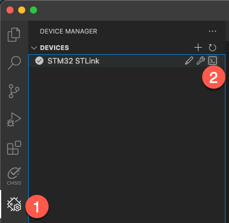
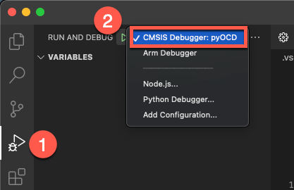

# Converting µVision Projects to CMSIS Solution Format

This hands-on lab demonstrates how to convert a µVision project (`.uvprojx`) to the CMSIS solution format using modern
development tools. The project, originally generated with the [Mongoose Wizard](https://mongoose.ws/wizard/), serves
as a realistic example used during the Arm Developer Meetup at Embedded World 2024.

An in-depth [tutorial](https://mongoose.ws/documentation/#tutorials) as well as the
[Mongoose User Guide](https://mongoose.ws/documentation/) are available for further details.

Objective: Convert, build, and debug a non-trivial embedded application on a modern development platform.

## Procedure Overview

The following steps provide the minimum required procedure to convert, build, and debug the project. Your instructor
may demonstrate additional features of Keil Studio.

### Step 1: Convert the Project

1. Launch VS Code and open the folder containing the `wizard.uvprojx` file.
2. Right-click the `wizard.uvprojx` file and choose **Convert µVision project to CMSIS solution**.
3. Edit the generated `wizard.csolution.yml` and `wizard.cproject.yml` as follows:

   - In `wizard.csolution.yml`, insert the following block before the `- projects` section:
  
     ```yml
       misc:
         - for-compiler: AC6
           C-CPP:
             - -gdwarf-5
           ASM:
             - -gdwarf-5
           Link:
             - --entry=Reset_Handler
     ```

   - In `wizard.cproject.yml`, append the following section:

     ```yml
       output:
         type:
         - elf
         - hex
    ```

4. Build the project. You should encounter a single expected warning:

   ```txt
   Warning: A1950W: The legacy armasm assembler is deprecated. Consider using the armclang integrated assembler instead.
   ```

### Step 2: Configure Debugging

1. Open the GUI view and add the Arm GNU Toolchain to `vcpkg_configuration.json` if not already present. Save the file.
2. Navigate to **CMSIS View → Manage Solution Settings → Run and Debug**. Click **+ Add New** to create a new
   debug configuration.
3. Select **CMSIS Debugger: pyOCD**. This will generate a `.vscode/launch.json` file.
4. In the **Explorer View**, go to `out/wizard/Target_1`, right-click `wizard.hex`, and choose **Copy Relative Path**.
5. In the `.vscode/launch.json` file, update the `load` command (around line 15) to include:

   ```json
   "load out/wizard/Target_1/wizard.hex",
   ```

6. Open the `cbuild-run.yml` file and modify the `system-resources:` node:

   - For all RAM entries, ensure:

     ```yml
             access: rwx
     ```

   - For all ROM entries, ensure:

     ```yml
             access: rx
     ```

> [!Note]
> This step will be automated in a future version of CMSIS-Toolbox.

### Step 3: Open a Serial Terminal

1. Go to the **Device Manager** view.
2. Open a serial console connected to the ST-Link interface.  
   
3. In the pop-up dialog, set the baud rate to **115200**.

### Step 4: Start the Debug Session

1. Switch to the **Debug View** and select **CMSIS Debugger: pyOCD**.
2. Click the **Play** icon to launch the debug session.  
   

### Step 5: Interact with the Web Server

Once the application is running, open a web browser and enter the IP address shown in the serial console to access the
device-hosted web server.

## Conclusion

This lab demonstrates how to convert a complex µVision project to the CMSIS solution format, integrate debugging support,
and interact with the deployed application—all using modern open-source tools.
